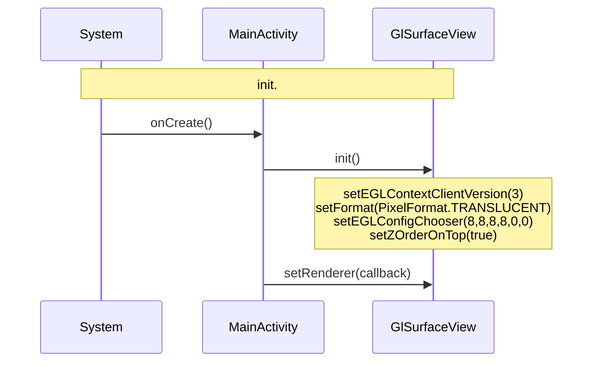
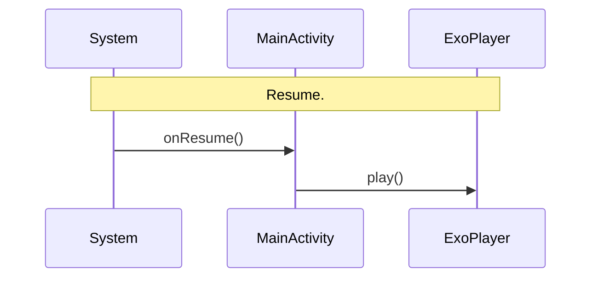
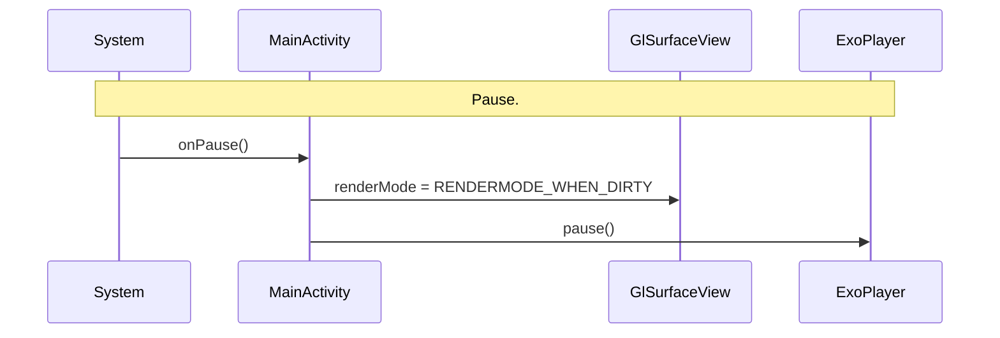
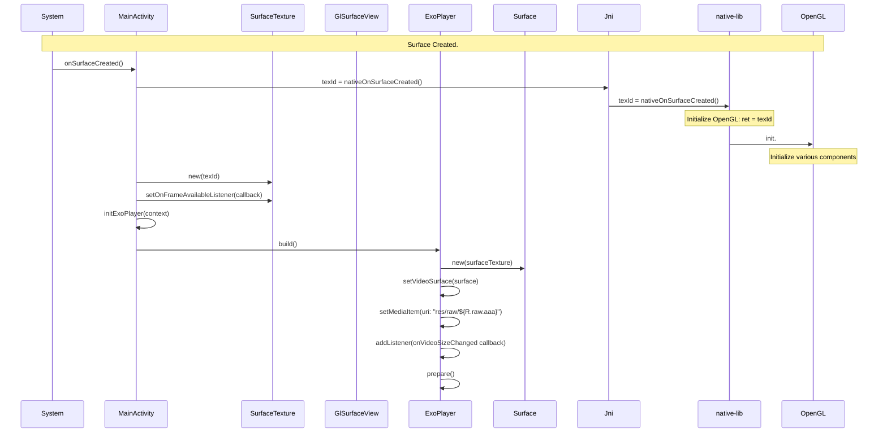
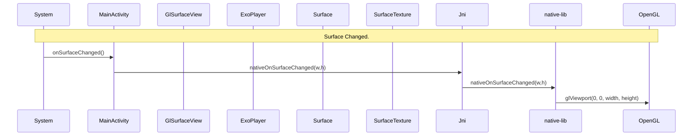
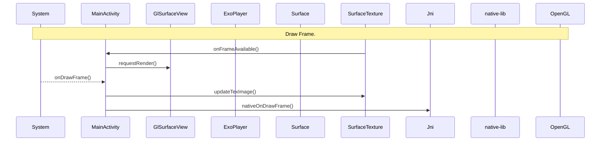

# AndKot-VideoPlaybackPlanePolySampleG
- Android Kotlin sample showing video playback on a C++ flat polygon (Gemini version).  
**It's finally done.**

# Sequence

## Init Sequence.

## Resume Sequence.

## Pause Sequence.

## Surface Created Sequence.

## Surface Changed Sequence.

## Draw Frame Sequence.

